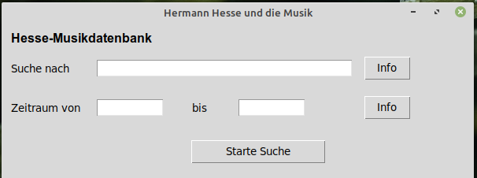

# Hermann Hesse und die Musik
Dieses Repositorium enthält eine Musikdatenbank mit Texten von Hermann Hesse über die Musik (eigene Aussagen und von fiktiven Erzählpersonen).

**Wichtig**: Die Datenbank befindet sich erst im Aufbau, genauso wie das dazugehörige Python-Programm, mit der die Datenbank komfortabel befragt werden kann.

## Beschreibung
In der Datenbank sollen Aussagen von Hermann Hesse und seinen Romanfiguren gesammelt werden, die dann über eine graphische Oberfläche durchsucht und ausgewertet werden können.
Ich habe mich bei der Erstellung für die Programmiersprache Python entschieden, weil damit sehr schnell Prototypen erstellt werden können und mit den Bibliotheken/Schnittstellen *tkinter* und *sqlite3* graphische Oberflächen und Datenbankmanagement leicht realisierbar sind. Zudem ist Python für alle gängigen Betriebssysteme verfügbar und damit plattformunabhängig. Über eine einfache graphische Oberfläche soll der Nutzer Suchbegriffe eingeben können. Die Ergebnisse werden dann anschließend in eine Text-Datei geschrieben (Name: "ergebnisse.txt"). Dort kann man sich die Suchergebnisse anschauen.

Momentan macht es noch keinen Sinn die Anwendung lokal auszuprobieren, da noch zu wenig Datensätze vorhanden sind (obwohl die Suche bereits funktioniert).

## Motivation

Getrieben wurde ich auch von der Frage, wie Forschungsdaten (oft von den Geisteswissenschaften) und ihre digitalen Anwendungen über mehrere Jahre funktionstüchtig zur Verfügung stehen können. Oft bin ich während meines Studiums auf digitale Forschungsprojekte gestoßen, bei denen schon nach vier Jahren kein Zugriff mehr auf Datenbanken möglich war (wenn die Daten überhaupt verfügbar waren), weil Bestandteile, Bibliotheken, Frameworks nach ein paar guten Jahren nun zueinander inkompatibel waren.

## Technische Informationen
* Die Datenbank "hesse-musik.db" ist eine SQLite3-Datenbank.
* Die graphische Nutzeroberfläche zur Befragung der Datenbank ist in Python (mit tkinter) erstellt worden.
* Die Anwendung besteht aus drei Dateien: der Datenbank (hesse-musik.db), der index.py-Datei und der app.py-Datei. Die index.py-Datei enthält die grundlegenden Elemente für die graphische Nutzeroberfläche und den Start des Programms. In der app.py-Datei sind die Funktionen und Unterprogramme ausgelagert.

## Ziele
* eine Datebank mit Musiktextstellen von Hermann Hesse erstellen 
* ein Programm zum Durchforsten der Datenbank erstellen --> wenn das Python-Programm fertig ist, muss nur noch die Datenbank vom Nutzer regelmäßig akutalisiert werden
* besseres Verständnis kriegen: Wie speichert man Daten, damit diese auch in 20-30 Jahren noch auslesbar sind? Stichwort: Forschungsdatenmanagement
* Anregungen für ähnliche Projekte erhalten
* sicherstellen, dass die Datenbank und die Anwendung auch noch in ferner Zukunft läuft und einfach zu installieren bzw. zu bedienen ist
* meine Python/tkinter/SQLite-Kenntnisse am Köcheln halten

## Noch zu machen:
* verständliche Bedienungsanleitung schreiben (LaTeX / im Ordner "doc")
* Datenbank befüllen mit weiteren Textstellen (Werkliste abarbeiten)
* weitere Filteroption: Nur in bestimmten Werken suchen (Werkliste erstellen und als SQL-Query hinzufügen)
* nach Erstellen einer 'ergebnisse.txt'-Datei einen Schalter anbieten zum einfachen Öffnen des Verzeichnisses
* Export der Suchergebnisse innerhalb eines Anwendungsfensters besser oder in eine HTML-Datei? (bisher in .txt-Datei)
* zum Abschluss des Python-Programmes: einfache Installationsdateien für Windows- MacOS- und Linux-Nutzer erstellen

## Werkliste und Stand der Datenbank
* [x] Ausgewählte Gedichte Teil I
* [ ] Ausgewhählte Gedichte Teil II
* [x] Die Morgenlandfahrt
* [x] Peter Camenzind
* [ ] Der Europäer
* [ ] Demian
* [ ] Unterm Rad
* [ ] Der Steppenwolf
* [ ] Klein und Wagner
* [ ] Das Glasperlenspiel
* [ ] Siddhartha
* [ ] Narziss und Goldmund
* [ ] ... 
